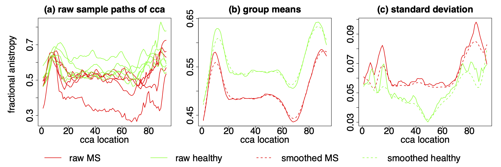
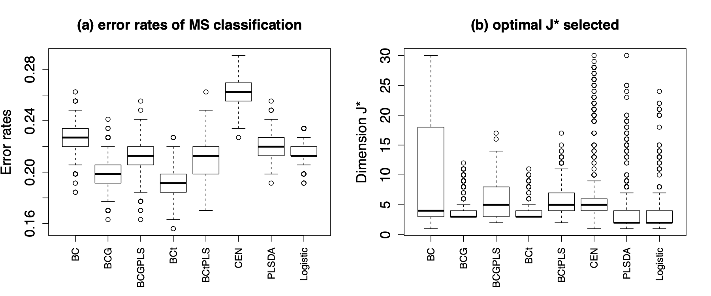

Copula-based Functional Bayes Classification:  
A Potential Approach to Early Diagnosis of Multiple Sclarosis
================
Wentian Huang
5/26/2020

# Methodology Background

This is a data case we explored in our article of \`\`Copula-based
Functional Bayes Classification with Principal Components and Partial
Least Squares’’ (Huang and Ruppert 2019), in which we present a new
semiparametric functional Bayes classifier that uses PC or PLS scores
from the common covariance function marginalized over binary groups. The
marginal densities are estimated nonparametrically by kernel smoothing
(KDE) and the copula is modeled parametrically for score dependencies.
For theoretical details please refer to
<https://arxiv.org/abs/1906.00538v2>.

The method is designed for **functional data**. Unlike traditional
multivariate data with fixed dimensions, functional data are observed as
smoothed sample curves over some certain continuum like time, location
etc., and they are considered to have infinite dimensions. Functional
magnetic resonance imaging (fMRI) is a classic field generating
functional data.

## Keywords

**Functional data** | **Bayes classification** | **Parametric copulas**
| **Dimension reduction** | **Principal components (PC)** | **Partial
least squares (PLS)** | **K-fold cross validation** | **Kernel density
estimation (KDE)** | **Bandwidth selection**

# Multiple Sclerosis

Multiple Sclerosis (MS) is a chronic disease causing disruption of
communication between the brain and the body. Symptoms and level od
severity vary from patient to patient. Some symptoms include vision
loss, pain, fatigue, and impaired coordination. MS can be reflected on
fractional anisotropy (FA) profiles of the patient’s corpus callosum
(cca) tract.

Fractional anisotropy (FA) is the degree of anisotropy of water
diffusion along a tract and is measured by diffusion tensor imaging
(DTI). Outside the brain, water diffusion is isotropic (Goldsmith et al.
2012). MS is an autoimmune disease leading to lesions in white matter
tracts such as the corpus callosum. These lesions decrease FA.

As MS has heterogeneous clinical performances, misdiagnosis is common
and a significant issue to resolve. According to a study conducted in
four academic MS centers, over 50% of patients carried a misdiagnosis
for at least 3 years, 70% had received disease-modifying therapy (DMTs),
and 31% experienced unnecessary morbidity as a direct result (Solomon et
al. 2016). Also currently, potential patients need to pay multiple
hospital visits before getting a diagnosis. We aim to look for a new
approach to the early diagnosis of MS, using our new copula-based Bayes
classifier.

## Data Description

The DTI dataset contains FA profiles at 93 locations on the corpus
callosum of 142 subjects. The data were collected at Johns Hopkins
University and the Kennedy-Krieger Institute. The numbers of visits per
subject range from 1 to 8, but we used only the 142 FA curves from first
visits for early diagnosis.

One subject with partially missing FA was removed. Among the 141
subjects, 42 were healthy (k = 0) and 99 were diagnosedwith MS (k = 1).
We used local linear regression for data pre-smoothing. To determine the
optimal number of dimensions J\* for each method, we used cross
validation with maximal J = 30. Misclassification rates by 10-fold
cross-validation were recorded for 1000 repetition.

## Output Summary

### MS v.s. Non-MS Group Comparison

 *In Figure 1, panel (a) shows profiles of fractional
anisotropy (FA), five each of cases and controls, while panels (b) and
(c) show group means and standard deviations. MS cases are red, and
solid versus dashed lines distinguish raw and smoothed data. It shows
that compared to controls, the MS group has both a lower mean and a
higher standard deviation.*

### Classification Performance

#### Table of error Rate

We compare classification performance through the misclassification
rates of eight methods: the first five are based on Bayes classifiers,
and the last three are non-Bayes:

  - **BC**: the original Bayes classifier of (Dai, Müller, and Yao
    2017);
  - Copula-based Functional Bayes Classifiers:
      - **BCG**: Bayes classifier using PC scores and a Gaussian copula.
        Kendall’s tau is used to estimate rank correlation;
      - **BCG-PLS**: similar to BCG, but uses PLS scores;
      - **BCt**: Bayes classifier using PC scores and a t-copula.
        Kendall’s tau is the rank correlation estimator, with the tail
        parameter nu estimated by pseudo-maximum likelihood;
      - **BCt-PLS**: similar to BCt, except that functions are projected
        onto PLS components
  - **CEN**: functional centroid classifier from (Delaigle and Hall
    2012);
  - **PLSDA**: binary classifier using Fisher’s linear discriminant rule
    with functional PLS as a dimension reduction method;
  - **logistic**: logistic regression on functional principal
    components.

Misclassification rates are reported in the table below. **BCt**
achieves the lowest error rate at **19.2%**. We also calculate the
marginal error of BCt’s misclassification rate, which is 0.0007 (0.07%).
Rates by other methods fail to fall into this range, and are all
significantly higher than
BCt’s.

| Method     | BC    | BCG   | BCG-PLS | **BCt**   | BCt-PLS | CEN   | PLSDA | logistic |
| ---------- | ----- | ----- | ------- | --------- | ------- | ----- | ----- | -------- |
| Error Rate | 0.228 | 0.199 | 0.211   | **0.192** | 0.211   | 0.264 | 0.219 | 0.216    |

#### Boxplot of error rates and selected cut-off dimension J

The boxplot below conveys similar message about the optimaility of BCt
in MS classification. In fact, the third quartile for BCt is below the
first quartile of all other methods except BCG.

Part (b) is a boxplot of the number of components (**J**) used during
each simulation, selected by cross validation. Here BCt and BCG show
their ability to achieve lowest misclassification with a minimal number
of dimensions. In addition, compared to other methods like centroid
classifier, PLSDA or logistic regression, their choice of optimal **J**
is very stable, with smallest variation and few outliers. In contrast,
BC is prone to employ a large number of components in classification.
Such tendency actually can be found in other examples too.

# References

Dai, Xiongtao, Hans-Georg Müller, and Fang Yao. 2017. “Optimal Bayes
Classifiers for Functional Data and Density Ratios.” *Biometrika* 104
(3). Oxford University Press: 545–60.

Delaigle, Aurore, and Peter Hall. 2012. “Achieving Near Perfect
Classification for Functional Data.” *Journal of the Royal Statistical
Society: Series B (Statistical Methodology)* 74 (2). Wiley Online
Library: 267–86.

Goldsmith, Jeff, Ciprian M Crainiceanu, Brian Caffo, and Daniel Reich.
2012. “Longitudinal Penalized Functional Regression for Cognitive
Outcomes on Neuronal Tract Measurements.” *Journal of the Royal
Statistical Society: Series C (Applied Statistics)* 61 (3). Wiley Online
Library: 453–69.

Huang, Wentian, and David Ruppert. 2019. “Copula-Based Functional Bayes
Classification with Principal Components and Partial Least Squares.”

Solomon, Andrew J, Dennis N Bourdette, Anne H Cross, Angela Applebee,
Philip M Skidd, Diantha B Howard, Rebecca I Spain, et al. 2016. “The
Contemporary Spectrum of Multiple Sclerosis Misdiagnosis: A Multicenter
Study.” *Neurology* 87 (13). AAN Enterprises: 1393–9.

